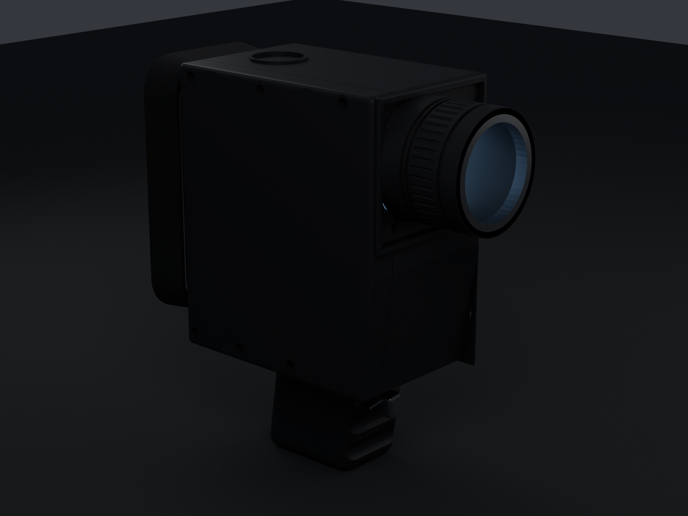

# Minolta XL-401 × iPhone 16 Pro

A 3D-printable camera body in the design language of the **Minolta XL-401** Super 8
cine camera, with the film cartridge chamber replaced by a cradle for an
**iPhone 16 Pro**. The phone stands portrait behind the lens board: its rear cameras
look forward through the lens opening, and its screen faces back down a finder
tunnel, so the thing you framed with in 1976 is the thing you frame with now.

**227 L × 232 H × 94 W mm · 13 printed parts · ~507 g of PLA · fits a 256³ bed**



Every dimension lives in one `PARAMS` block at the top of `build_xl401.py`. Change a
number, re-run, get a new set of STLs.

---

## Read this before you print

**It is not a scale replica, and it can't be.** The real XL-400 (the XL-401's
near-identical predecessor) is 48 × 103 × 184 mm. An iPhone 16 Pro is 71.5 mm wide —
half again as wide as that entire camera body — and 149.6 mm tall. Standing one
upright inside a Super 8 body forces a bigger, taller camera. This is an homage in
the XL-401's idiom, not a copy of it. If you want the real proportions, scale the
whole `PARAMS` block instead.

**It shoots vertical video by default.** The phone is physically portrait, so iOS
records portrait. That is fine for anything going to Reels, Shorts or TikTok. For
16:9, use a camera app that locks orientation independently of the device —
Blackmagic Camera (free) and Filmic Pro both do.

**The lens is 10.9 mm off the centreline. That is deliberate.** The iPhone's camera
plateau sits in the corner of its back, not the middle, so the optical axis lands
off-centre however you place the phone. Centring it would need a 100 mm-wide body.
The photocell window and badge recess on the other side of the lens board are there
to balance it, the way the real cameras balance a meter cell against the lens.

---

## The two lens modes

A Super 8 zoom barrel is a tube in front of the lens, and a tube is exactly what
vignettes a phone camera. So the barrel twists off:

| | Barrel fitted | Barrel removed |
|---|---|---|
| Ultra-wide 0.5× (needs 60°) | 12.0° — vignettes | **68.6° — clear** |
| Main 1× (needs 36.5°) | 12.0° — vignettes | **66.5° — clear** |
| Tele 5× (needs 11.5°) | **12.0° — clear** | **64.8° — clear** |
| Use it for | the shelf, and 5× shots | shooting |

Those numbers are measured, not asserted: `build_xl401.py` ray-casts the assembled
geometry from each lens position and reports the largest cone that reaches open air.
See `VALIDATION.md`.

Getting there drove two design decisions worth knowing about, because they look
arbitrary otherwise:

- **The barrel mount is a groove cut into the lens board, not a ring standing proud
  of it.** A protruding ring is the closest solid to the phone's lenses, so it — not
  the aperture — sets the clear cone. At 8 mm proud it held the usable cone to 41°.
  Recessed, nothing stands forward of the board face and the aperture governs again.
- **The lens board is only 6 mm thick at the aperture, which flares outward at 30°.**
  The narrow end sits 1 mm in front of the camera plateau and the walls fall away
  faster than any lens can see.

---

## Parts

| # | Part | Print notes |
|---|---|---|
| 01 | `body_main` | Outer face down, seam up. All internal voids open upward — no supports. Longest print, ~200 g. |
| 02 | `body_panel` | The service panel. Outer face down, flat and quick. |
| 03 | `grip` | Stands on its base, tenon up. Nut trap opens downward, so no supports. |
| 04 | `lens_board` | Aperture face up. |
| 05 | `lens_barrel` | Mouth down, concentric. |
| 06 | `lens_ring` | Contrast colour — this is the one bright part on the camera. |
| 07 | `phone_door` | Flange face down. |
| 08 | `eyecup` | TPU 95A if you have it, PLA if not. |
| 09 | `trigger` | Tiny; print alongside something else. |
| 10–12 | `shim_0p8` / `1p6` / `3p2` | Flat frames. Print the one your case needs. |
| 13 | `phone_gauge` | **Print this first.** |

### Print the gauge first

`13_phone_gauge` is a dummy iPhone 16 Pro at cased dimensions. It takes about
40 minutes. Check it drops into the cavity in the finished body before you commit
20 hours to `01_body_main` — and if the cavity is wrong, you have adjusted one
number rather than reprinted a shell.

### Settings

| | |
|---|---|
| Nozzle / layer | 0.4 mm / 0.2 mm |
| Walls | 4 perimeters (parts are designed around a 2.6 mm wall) |
| Infill | 20 % gyroid |
| Supports | none, in the orientations above |
| Material | PLA or PETG; TPU 95A for the eyecup |
| Total | ~507 g, roughly 40 h across all parts |

The shell prints with its outer face on the bed and the seam upward on purpose:
every pocket, bore and boss then opens toward the sky.

---

## Hardware

| Qty | Item | For |
|---|---|---|
| 6 | M3 × 25 socket head, self-tapping into plastic | Panel to body. Spotfaced into the outer face. |
| 4 | Ø3 × 18 mm dowel pins (or 3 mm filament offcuts) | Panel alignment |
| 4 | M3 × 10 | Phone door |
| 2 | M3 × 10 | Lens board, through its face into the body |
| 1 | 1/4"-20 hex nut, 11.1 mm A/F × 5.6 mm | Tripod socket in the grip |

Prefer machine screws? Open the Ø2.5 pilot holes to Ø4.2 and use M3 heat-set
inserts — set `pilot_d` to `insert_d` in `PARAMS` and re-run.

---

## Assembly

1. **Nut trap.** Press the 1/4"-20 nut into the grip's base. A hot soldering iron
   seats it flush if it's tight.
2. **Grip.** Drop its T-tenon into the pocket in the body floor. It is captured when
   the panel goes on — there are no grip fasteners to lose.
3. **Lens board.** Sit it in the front rebate and run two M3 × 10 through the
   counterbored holes in its lower margin, into the body behind. Those pilot holes
   stop 1.2 mm short of the phone cavity, so don't overdrive them. Check the aperture
   lines up with where the phone's plateau will sit; this is the part to reprint if
   your measurements differ from mine.
4. **Panel.** Fit the four dowel pins, close the panel onto the body, and run the six
   M3 × 25 in from outside. Snug, not tight — you are threading into plastic.
5. **Eyecup.** Push it over the collar around the rear window. Friction fit.
6. **Trigger and lens ring.** Press fit.
7. **Load the phone.** Open the side door, slide the phone in screen-first (screen
   toward the finder), add whichever shim takes up the slack, close the door.

| Your phone | Shim |
|---|---|
| Bare | `shim_3p2` |
| Thin case (~1.5 mm) | `shim_1p6` |
| Slim case (~2.5 mm) | `shim_0p8` |
| Thick case (~3.2 mm) | none |

Shims are frames, not plates — they press on the phone's bezel and leave the screen
clear. Each is a 20-minute print, so a new case or a different phone is one small
reprint, not a new camera.

---

## Using it

Take the barrel off to shoot. The rear window frames the middle **90 % × 84 %** of
the screen, cropped harder at the bottom — which is where a landscape-locked camera
app puts its controls, and it leaves the shell's floor thick enough to hold the grip
tenon. The 122 mm finder tunnel doubles as a sun shade; in bright light the screen is
markedly easier to read than a bare phone.

The 1/4"-20 socket in the grip base takes a tripod, a monopod, or a strap adapter.

---

## Rebuilding it

```bash
pip install bpy==4.5.3 trimesh manifold3d rtree numpy
python3 build_xl401.py export          # STLs, 3MF, GLB, .blend, VALIDATION.md
python3 build_xl401.py render hero_front
python3 build_xl401.py exploded
```

`build_xl401.py` runs headless against Blender-as-a-module, or inside Blender with
`blender -b -P build_xl401.py`. `xl401.blend` is the same model if you would rather
push vertices by hand.

Geometry is built with primitives and CSG. The kernel is `manifold3d` rather than
Blender's own boolean modifier — both of Blender's solvers segfault
nondeterministically on this model in a headless build, and manifold3d is
guaranteed-manifold by construction, which is what a print needs. Set
`XL401_SOLVER=EXACT` to use Blender's instead.

### Numbers worth knowing before you change things

| Parameter | Value | Why it is what it is |
|---|---|---|
| `body_w` | 94 mm | Barrel clearance around an off-centre lens. 100 mm would centre the lens. |
| `body_top` / `body_bottom` | 230 / 62 | A 152 mm cavity plus walls, and 62 mm of exposed grip. |
| `lens_board_t` | 6 mm | Thin, because the aperture's depth sets the vignetting. |
| `spigot_len` | 4 mm | Recessed. At 8 mm proud it cost 27° of clear cone. |
| `wedge_cut` | 26 → clamped to 8.6 | Clamped in `derive()` so the front rake can't cut into the cavity. |
| `tun_crop_bottom` | 22 mm | Buys 25 mm of floor for the grip tenon. |
| `split_x` | +30 mm | Off-centre seam: a centre split would need 55 mm screws. |
| `phone_dx` | 0 | Centred, so everything but the lens is symmetric. |

---

## Where the reference numbers came from

Minolta XL-400 dimensions and the Rokkor 8.5–34 mm f/1.2 zoom are published spec.
The XL-401's exact body dimensions are not, so the proportions here are read from
photographs of the camera and its family — treat the silhouette as an interpretation.

The iPhone 16 Pro's overall size (149.6 × 71.5 × 8.25 mm) is Apple's published spec.
The camera plateau's size and inset are nominal figures, which is why the aperture is
oversized: a few millimetres of error there changes nothing. If yours measures
differently, set `plateau_w`, `plateau_inset_x` and `plateau_inset_top` and reprint
the 9 g lens board.

## Licence

Design and code released under CC0. It is a homage to a Minolta product; Minolta and
Apple own their respective marks, and nothing here is affiliated with or endorsed by
either.
